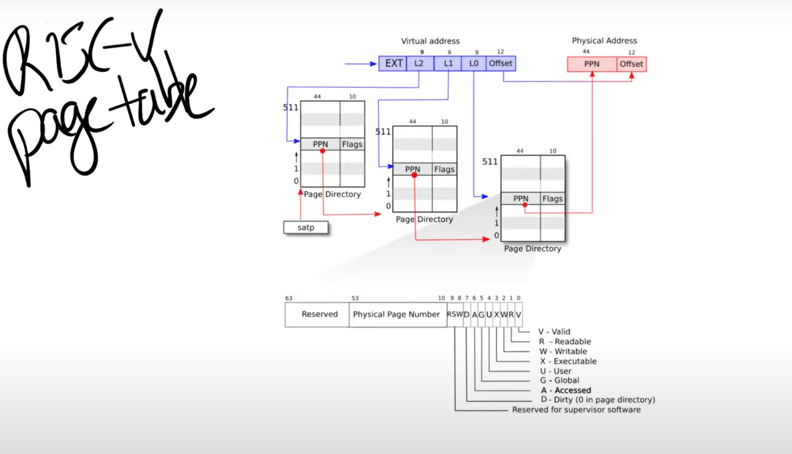

1. **原因：** 从用户空间进入内核空间后若内核需要引用用户空间的虚拟地址，必须使用软件的方法对虚拟地址进行翻译找到对应的物理地址，软件映射的方法通常比mmu映射的方法耗时，为了提升性能可以将内核页表与用户进程页表合并为一张页表。

2. 此方案依赖于**用户的虚拟地址范围不与内核用于自身指令和数据的虚拟地址范围重叠。** 内核启动后xv6内核的最低虚拟地址为0xC000000，所以我们可以将0-0xC000000作为进程的虚拟内存地址。

3. 主要步骤为
   1. 在每个进程的结构体字段struct proc中加入合并页表字段
   ```c
   struct proc{
    ...
    pagetable_t kernelpt;//为进程维护一个内核页表 pagetabel_t:uint64 *
   };
   ```
   2. 在进程初始化时拷贝内核页表kernel_pagetable进p->kernelpt
   ```c
   static struct proc* allocproc(void){
        ...
        p->kernelpt = proc_kpt_init();
        //设置内核栈
        char *pa = kalloc();
        if(pa == 0)
            panic("kalloc");
        uint64 va = KSTACK((int) (p - proc));
        uvmmap(p->kernelpt, va, (uint64)pa, PGSIZE, PTE_R | PTE_W);
        p->kstack = va; //改变了原来的p->kstack
   }

    pagetable_t proc_kpt_init(){
        pagetable_t kernelpt = uvmcreate();
        if (kernelpt == 0) return 0;
        uvmmap(kernelpt, UART0, UART0, PGSIZE, PTE_R | PTE_W);
        uvmmap(kernelpt, VIRTIO0, VIRTIO0, PGSIZE, PTE_R | PTE_W);
        uvmmap(kernelpt, CLINT, CLINT, 0x10000, PTE_R | PTE_W);
        uvmmap(kernelpt, PLIC, PLIC, 0x400000, PTE_R | PTE_W);
        uvmmap(kernelpt, KERNBASE, KERNBASE, (uint64)etext-KERNBASE, PTE_R | PTE_X);
        uvmmap(kernelpt, (uint64)etext, (uint64)etext, PHYSTOP-(uint64)etext, PTE_R | PTE_W);
        uvmmap(kernelpt, TRAMPOLINE, (uint64)trampoline, PGSIZE, PTE_R | PTE_X);
        return kernelpt;
    }
   ```
   3. 在进行线程的上下文切换时，修改scheduler()函数加载进程的内核页表到satp寄存器。并切换页表后刷新TLB。这样在内核空间中就可以使用进程的内核页表。
    ```c
    for (;;){
        ...
        for(p = proc; p < &proc[NPROC]; p++) {
            acquire(&p->lock);
            if(p->state == RUNNABLE) {
                // Switch to chosen process.  It is the process's job
                // to release its lock and then reacquire it
                // before jumping back to us.
                p->state = RUNNING;
                c->proc = p;

                proc_inithart(p->kernelpt);

                swtch(&c->context, &p->context);

                // Process is done running for now.
                // It should have changed its p->state before coming back.
                kvminithart();      

                c->proc = 0;

                found = 1;
            }
            release(&p->lock);
        }
    }
    ```
    4. 释放一个进程的内核栈和内核页表，这里有个细节是不能把实际物理地址也释放掉。
    ```c
    void uvmunmap(pagetable_t pagetable, uint64 va, uint64 npages, int do_free);
    static void freeproc(struct proc *p){
        ...
        //首先应当释放内核栈
        uvmunmap(p->kernelpt, p->kstack, 1, 1);
        p->kstack = 0;
        //释放物理页表，使用kfree
        dfs(p->kernelpt, 1);
    }
    static void dfs(pagetable_t pagetable, int level){
        if (level == 3){
            kfree((void *)pagetable);
            return;
        }

        for (int i = 0; i < 512; ++i){
            pte_t pte = pagetable[i];
            if (pte & PTE_V){
                dfs((pagetable_t)(PTE2PA(pte)), level + 1);
            }
        }

        kfree((void *)pagetable);
    }
    ```

    5. 当内核修改进程p->pagetable的时候，需要对应修改p->kernelpt;像fork、exec、sbrk之类的系统调用。这里有个细节是，内核只能访问PTE标志位PTE_U是0的PTE，所以对p->pagetable进行复制时PTE_U标志位需要置0。还有需要限制进程的虚拟内存不能超过0xC000000。
    ```c
    void u2kvmcopy(pagetable_t pagetable, pagetable_t kernelpt, uint64 oldsz, uint64 newsz){
        pte_t *pte_from, *pte_to;
        oldsz = PGROUNDUP(oldsz);
        for (uint64 i = oldsz; i < newsz; i += PGSIZE){
            if((pte_from = walk(pagetable, i, 0)) == 0)
            panic("u2kvmcopy: src pte does not exist");
            if((pte_to = walk(kernelpt, i, 1)) == 0)
            panic("u2kvmcopy: pte walk failed");
            uint64 pa = PTE2PA(*pte_from);
            uint flags = (PTE_FLAGS(*pte_from)) & (~PTE_U);
            *pte_to = PA2PTE(pa) | flags;//这里并不是真正的拷贝，只是映射到同一个物理地址。
        }
    }
    ```